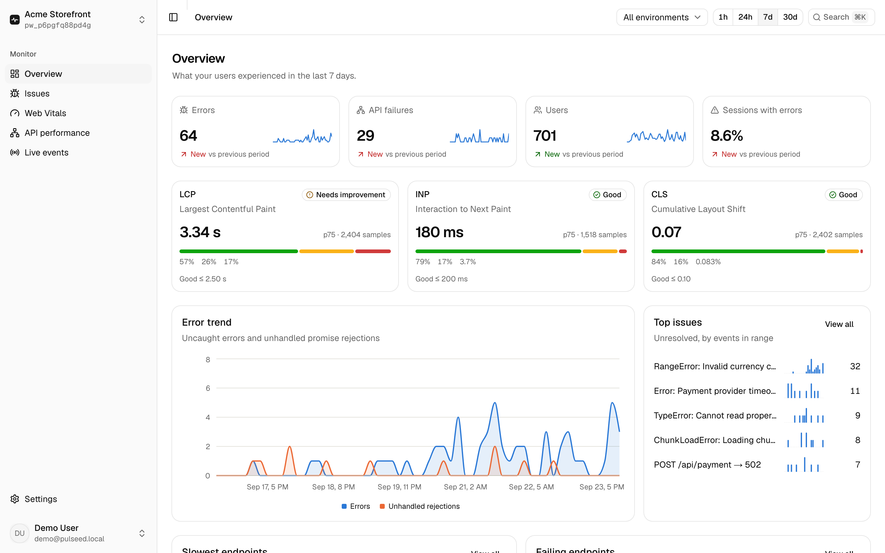

# TraceForge

**Open-source frontend observability.** A lightweight browser SDK, an ingestion API and a
dashboard that show you **what failed, where, how often, and who it affected**: JavaScript
errors, unhandled rejections, failing and slow API calls, Core Web Vitals and navigation performance.

<picture>
  <source media="(prefers-color-scheme: dark)" srcset="apps/dashboard/public/landing/overview-dark.png">
  
</picture>

> **Status: actively developed, pre-release.** The SDK (core, React and Next.js integrations),
> ingestion API, dashboard, alert webhooks and release tracking are built and tested end to end
> locally. Publishing to npm and hosting are next; see the
> [roadmap](.claude/skills/traceforge/SKILL.md#roadmap).

**[Read the guide →](https://thetraceforge.vercel.app/guide)** for setup, framework integrations,
alerts, releases and configuration.

## Why

Frontend apps fail in production in ways you can't reproduce locally: a `TypeError` that only
hits Safari, an endpoint that fails for 0.5% of users, an LCP regression after a release.
TraceForge captures these from real sessions with minimal overhead and groups them into issues you can act on.

## Quick start

```bash
npm install @traceforge/sdk
```

```ts
import { init } from "@traceforge/sdk"

init({
  dsn: "https://<publicKey>@traceforge.example.com/project/<projectId>",
  environment: "production",
})
```

For Next.js, initialize in `instrumentation-client.ts` so monitoring starts before hydration, and
add [`@traceforge/sdk/next`](packages/sdk/README.md#nextjs) to catch errors in Server Components,
Route Handlers and Server Actions. The SDK is not on npm yet. Until it is, run
`pnpm --filter @traceforge/sdk build && pnpm --filter @traceforge/sdk pack` and `npm install` the
resulting `.tgz` in your app. Full walkthrough: [the guide](https://thetraceforge.vercel.app/guide).

## Features

- **Issues:** uncaught errors and unhandled rejections, grouped by fingerprint across deploys, with
  occurrences, affected users, stack traces (library frames collapsed), and browser, OS, device and page breakdowns.
- **API performance:** every `fetch` your frontend makes, per endpoint: requests, error rate, avg and p95
  latency, status codes and recent failures.
- **Web Vitals:** LCP, INP, CLS, FCP and TTFB at p75 with ratings, distributions, trends and the slowest routes.
- **Live events:** a real-time stream over SSE.
- **React & Next.js:** an error boundary for render errors (`@traceforge/sdk/react`), and a
  server-side hook for Server Components, Route Handlers and Server Actions (`@traceforge/sdk/next`).
- **Alerts:** webhook (Slack or any HTTPS endpoint) notifications on new issues and regressions.
- **Releases:** tag a deploy and see its events, issues and affected users on their own.
- **A 9 KB SDK** with no runtime dependencies. It batches, compresses, retries with backoff, and delivers
  on page hide via `sendBeacon`. It never throws into your app.

## Architecture

```text
Browser app ──► @traceforge/sdk ──► POST /api/v1/events ──► PostgreSQL ──► Dashboard
                 │                    (Fastify: validate,                    (Next.js 16,
                 ├ errors             auth, rate-limit,                       shadcn/ui,
                 ├ rejections         fingerprint, group)                     Recharts)
                 ├ fetch / XHR
                 ├ Web Vitals        Event lifecycle:
                 ├ navigation        Browser → SDK → Queue → Worker → API → DB → Dashboard
                 └ performance
```

| Path                    | What                                                                   |
| ----------------------- | ---------------------------------------------------------------------- |
| `packages/sdk`          | `@traceforge/sdk`: zero runtime dependencies, ESM, CJS and a CDN build |
| `packages/event-schema` | The wire contract: Zod schemas, TypeScript types and limits            |
| `packages/shared`       | Fingerprinting, stack parsing, URL redaction, Web Vitals ratings       |
| `packages/ui`           | shadcn/ui (Base UI) components and design tokens                       |
| `apps/api`              | Fastify ingestion, auth and query API; owns the database               |
| `apps/dashboard`        | The Next.js dashboard                                                  |
| `apps/demo`             | An intentionally broken app for trying TraceForge live                 |

## Privacy

TraceForge collects **technical** context by default and nothing personal:

- **Collected:** error name, message and stack; the request method, redacted URL, status and duration; Web Vitals;
  route changes; browser, OS, device type, viewport, language and connection type; a random per-tab session id.
- **Never collected:** input values, passwords, cookies, `Authorization` headers, request or response bodies,
  `localStorage` contents, or query-string values (they are redacted before leaving the browser).
- **Opt-in:** `privacy: { captureUserContext: true }` adds a random, non-personal installation id for
  counting affected users.

## Development

Requirements: Node ≥ 22.12, pnpm 12, Docker (for Postgres).

```bash
pnpm install
cp apps/api/.env.example apps/api/.env              # set BETTER_AUTH_SECRET (openssl rand -base64 32)
cp apps/dashboard/.env.example apps/dashboard/.env.local
pnpm db:up && pnpm db:migrate
pnpm db:seed      # demo@traceforge.local / correct-horse-battery + a week of data; prints a DSN
cp apps/demo/.env.example apps/demo/.env.local      # paste the DSN printed by db:seed
pnpm dev          # api :4000 · dashboard :3000 · demo :3001
```

If a port is taken, change `PORT` in `apps/api/.env` and `API_URL` / the DSN to match.

## Testing

| Command                    | What it runs                                                                                                                                                                                           |
| -------------------------- | ------------------------------------------------------------------------------------------------------------------------------------------------------------------------------------------------------ |
| `pnpm check`               | Prettier, ESLint, TypeScript, all unit and integration tests (API tests use the `traceforge_test` database), and every build. CI runs this.                                                            |
| `pnpm e2e`                 | Playwright: the real SDK bundle in Chromium (errors, fetch, vitals, beacons, SPA navigation).                                                                                                          |
| `E2E_FULLSTACK=1 pnpm e2e` | With the stack running and seeded, also: demo trigger → dashboard, poor LCP and CLS from the demo, and every dashboard screen checked for console errors and WCAG 2.2 AA violations in light and dark. |

To try it by hand: open the demo at http://localhost:3001, click **Trigger API error**, then open the
dashboard at http://localhost:3000, sign in, and look at **Issues** or **Live events**.

## Deploying

Free tiers all the way: dashboard and demo on Vercel, API on Render, Postgres on Neon, and the SDK
published to npm from GitHub Actions. Step by step: [docs/DEPLOY.md](docs/DEPLOY.md).

## Contributing

Contributions are welcome. Read [CONTRIBUTING.md](CONTRIBUTING.md) first.

## License

[MIT](LICENSE)
